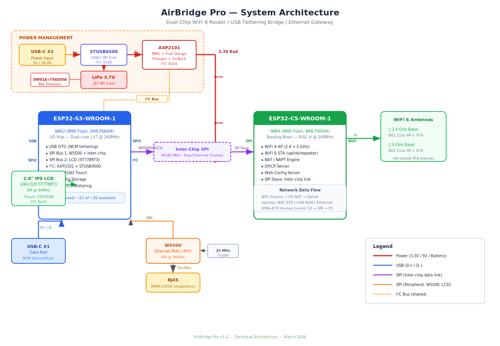
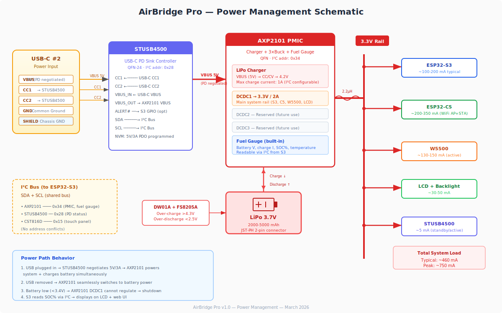
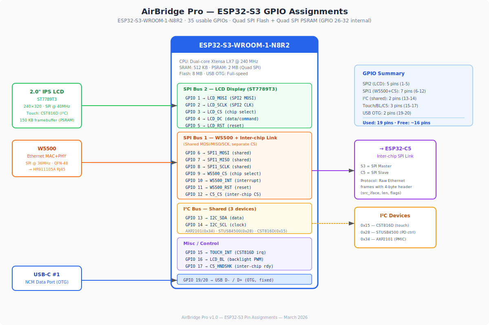
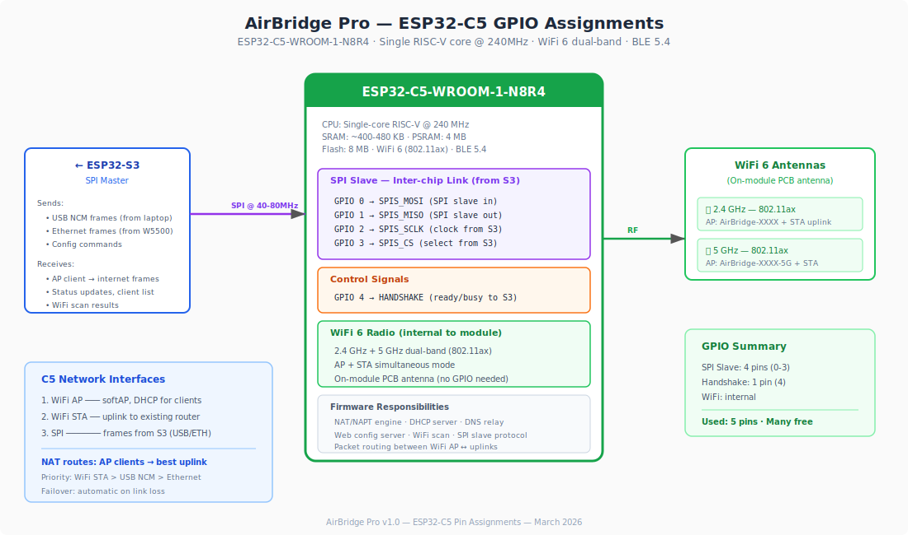

# AirBridge Pro — Technical Specification

**Version:** 1.0  
**Date:** March 2026  
**Status:** Hardware Design Phase  

---

## 1. Product Overview

AirBridge Pro is a portable, battery-powered multi-mode network bridge built on a dual-chip ESP32 architecture. It provides WiFi 6 access point, WiFi-to-WiFi repeater, USB NCM internet tethering, and wired Ethernet — all managed through a 2.0" capacitive touchscreen LCD and web configuration interface.

### Key Capabilities

- **WiFi 6 Access Point** — 802.11ax dual-band (2.4 GHz + 5 GHz) via ESP32-C5
- **WiFi Repeater** — STA mode connects to upstream WiFi, NAT bridges to AP clients
- **USB NCM Tethering** — USB-C data port for internet sharing from laptop/phone
- **Wired Ethernet** — 10/100 Mbps RJ45 port via W5500
- **Touchscreen UI** — 2.0" IPS 240×320 capacitive touch display
- **Battery Powered** — 3.7V LiPo with USB-C PD charging (5V/3A)
- **Web Configuration** — Full settings UI accessible from any connected client

### Architecture Philosophy

Two specialized chips, each doing what it does best:
- **ESP32-S3** — I/O hub: USB OTG, LCD, Ethernet, power management
- **ESP32-C5** — Routing brain: WiFi 6, NAT/NAPT, DHCP, web server

Connected via a high-speed SPI link carrying raw Ethernet frames.

---

## 2. System Architecture

> **Diagram:** [docs/diagrams/system_architecture.svg](diagrams/system_architecture.svg)




### Data Flow

```
Internet Sources (uplinks):
  ├─ WiFi STA (C5 connects to upstream router)
  ├─ USB NCM  (S3 receives from laptop → SPI → C5)
  └─ Ethernet (S3 receives from W5500 → SPI → C5)
        │
    [ESP32-C5: NAT/NAPT Engine]
        │
  WiFi AP Clients (phones, laptops, IoT devices)
```

All uplink frames are routed through the C5's NAT engine. The C5 selects the active uplink based on availability, with automatic failover:

**Priority:** WiFi STA > USB NCM > Ethernet

### Inter-Chip SPI Protocol

The S3 (master) and C5 (slave) communicate over SPI at 40-80 MHz. Each frame carries a 4-byte header:

| Byte | Field | Description |
|------|-------|-------------|
| 0 | `src_iface` | Source interface (0=USB, 1=ETH, 2=CMD) |
| 1-2 | `length` | Payload length (big-endian) |
| 3 | `flags` | Direction, priority, etc. |

Followed by the raw Ethernet frame (up to 1514 bytes). The HANDSHAKE pin signals when the C5 has frames ready for the S3 to clock out.

---


## 3. Component Selection

### 3.1 ESP32-S3-WROOM-1-N8R2

**Role:** I/O Hub  
**Why N8R2:**
- 8 MB Flash — room for firmware + OTA update partition
- 2 MB PSRAM (Quad SPI) — LCD framebuffer (150 KB) + network frame buffers
- Quad SPI PSRAM preserves GPIO 33-37 (unlike Octal in N16R8)
- Dual-core LX7 @ 240 MHz — one core for USB/SPI, one for display

### 3.2 ESP32-C5-WROOM-1-N8R4

**Role:** Routing Brain  
**Why N8R4:**
- 8 MB Flash — WiFi 6 driver + NAT + web server firmware + OTA
- 4 MB PSRAM — WiFi AP+STA simultaneous mode is memory-intensive
- WiFi 6 (802.11ax) dual-band 2.4 + 5 GHz
- Single RISC-V core @ 240 MHz — sufficient for packet routing

### 3.3 W5500 (WIZnet)

**Role:** Ethernet MAC + PHY  
**Interface:** SPI @ 36 MHz (shared bus with inter-chip link)  
**Features:** 10/100 Mbps, hardware TCP/IP stack, QFN-48 package  
**Clock:** External 25 MHz crystal

### 3.4 HR911105A

**Role:** RJ45 Ethernet Jack  
**Features:** Integrated magnetics (isolation transformers built into housing), LED indicators  

### 3.5 AXP2101 (X-Powers)

**Role:** Power Management IC  
**Features:**
- Single-cell LiPo charger (CC/CV, up to 1A, configurable via I²C)
- 3× DC-DC buck converters (DCDC1 used for 3.3V/2A system rail)
- Built-in coulomb-counter fuel gauge (battery V, I, SOC%, temperature)
- I²C control interface (address: 0x34)
- Power path management (USB → system + charge; battery → system on disconnect)

**Limitation:** Buck-only (not buck-boost). Cannot regulate 3.3V when battery drops below ~3.4V. Low-voltage cutoff set at 3.3V — loses bottom ~10% of LiPo capacity.

### 3.6 STUSB4500 (STMicroelectronics)

**Role:** USB-C Power Delivery Sink Controller  
**Interface:** I²C (address: 0x28) + NVM for standalone operation  
**Configuration:** NVM programmed once for 5V/3A PDO. Auto-negotiates on every plug-in without MCU intervention.  
**Pins:** CC1, CC2 from USB-C power port; VBUS output to AXP2101; ALERT# to S3 GPIO (optional)

### 3.7 DW01A + FS8205A

**Role:** LiPo Battery Protection  
**Features:** Over-charge (>4.3V), over-discharge (<2.5V), over-current protection  
**Note:** Skip if battery pack includes built-in protection circuit

### 3.8 2.0" IPS LCD (ST7789T3 + CST816D)

**Role:** Status Display + Touch Input  
**Display:** 240×320, IPS, 262K colors, SPI interface @ 40 MHz  
**Touch:** CST816D capacitive controller, I²C (address: 0x15), interrupt-driven  
**Framebuffer:** 150 KB (240 × 320 × 16bpp), stored in PSRAM

---

## 4. Power Management

> **Diagram:** [docs/diagrams/power_management.svg](diagrams/power_management.svg)



### Power Path

```
USB-C #2 (5V/3A) → STUSB4500 (PD) → AXP2101 VBUS → Charges battery + Powers system
Battery (3.7V)   → AXP2101 DCDC1   → 3.3V system rail (all components)
```

### Power Budget

| Subsystem | Typical | Peak |
|-----------|---------|------|
| ESP32-C5 (WiFi AP+STA) | 200 mA | 350 mA |
| ESP32-S3 (USB + SPI×2) | 100 mA | 200 mA |
| W5500 (Ethernet active) | 130 mA | 150 mA |
| LCD + backlight | 30 mA | 50 mA |
| STUSB4500 | 5 mA | 5 mA |
| **Total** | **~465 mA** | **~755 mA** |

### Battery Life Estimates

| Battery | Active (WiFi + screen) | Standby |
|---------|----------------------|---------|
| 2000 mAh | ~4 hours | ~20 hours |
| 3000 mAh | ~6 hours | ~30 hours |
| 5000 mAh | ~10 hours | ~50 hours |

### Charging

- USB-C PD: 5V/3A (15W available, ~5W used for charging + system)
- Charge rate: 1A (configurable via I²C)
- Charge time (2000 mAh): ~2.5 hours (with system running)

---

## 5. Pin Assignments

> **Diagrams:**
> - [docs/diagrams/esp32_s3_connections.svg](diagrams/esp32_s3_connections.svg)
> - [docs/diagrams/esp32_c5_connections.svg](diagrams/esp32_c5_connections.svg)






### 5.1 ESP32-S3 GPIO Map

| GPIO | Function | Peripheral | Bus |
|------|----------|------------|-----|
| 1 | LCD_MOSI | ST7789T3 | SPI2 |
| 2 | LCD_SCLK | ST7789T3 | SPI2 |
| 3 | LCD_CS | ST7789T3 | SPI2 |
| 4 | LCD_DC | ST7789T3 | SPI2 |
| 5 | LCD_RST | ST7789T3 | SPI2 |
| 6 | SPI1_MOSI | W5500 + C5 | SPI1 (shared) |
| 7 | SPI1_MISO | W5500 + C5 | SPI1 (shared) |
| 8 | SPI1_SCLK | W5500 + C5 | SPI1 (shared) |
| 9 | W5500_CS | W5500 | SPI1 |
| 10 | W5500_INT | W5500 | GPIO (input) |
| 11 | W5500_RST | W5500 | GPIO (output) |
| 12 | C5_CS | ESP32-C5 | SPI1 |
| 13 | I2C_SDA | AXP2101, STUSB4500, CST816D | I²C |
| 14 | I2C_SCL | AXP2101, STUSB4500, CST816D | I²C |
| 15 | TOUCH_INT | CST816D | GPIO (input) |
| 16 | LCD_BL | Backlight | PWM |
| 17 | C5_HANDSHAKE | ESP32-C5 | GPIO (input) |
| 19 | USB_D- | USB-C #1 | USB OTG |
| 20 | USB_D+ | USB-C #1 | USB OTG |

**Used:** 19 pins · **Free:** ~16 pins

### 5.2 ESP32-C5 GPIO Map

| GPIO | Function | Peripheral | Bus |
|------|----------|------------|-----|
| 0 | SPIS_MOSI | ESP32-S3 | SPI Slave |
| 1 | SPIS_MISO | ESP32-S3 | SPI Slave |
| 2 | SPIS_SCLK | ESP32-S3 | SPI Slave |
| 3 | SPIS_CS | ESP32-S3 | SPI Slave |
| 4 | HANDSHAKE | ESP32-S3 | GPIO (output) |

**Used:** 5 pins · WiFi radio is internal to module (no GPIO)

### 5.3 I²C Bus Addresses

| Address | Device | Function |
|---------|--------|----------|
| 0x15 | CST816D | Capacitive touch controller |
| 0x28 | STUSB4500 | USB-C PD sink controller |
| 0x34 | AXP2101 | PMIC + fuel gauge |

No address conflicts. All on shared SDA/SCL (GPIO 13/14 on S3).

---

## 6. Connectors

| Connector | Type | Function |
|-----------|------|----------|
| USB-C #1 | USB 2.0 data + power | NCM tethering (S3 OTG) |
| USB-C #2 | Power only (CC1/CC2 + VBUS + GND) | PD charging input |
| RJ45 | HR911105A w/ integrated magnetics | 10/100 Ethernet |
| JST-PH 2-pin | 1.25mm pitch | LiPo battery |
| LCD FPC | 15-pin or 18-pin FPC | Display + touch |

---

## 7. Bill of Materials

### Core Modules
| Part | Description | ~Unit Cost |
|------|-------------|------------|
| ESP32-S3-WROOM-1-N8R2 | I/O hub, 8MB flash, 2MB PSRAM | $3.50 |
| ESP32-C5-WROOM-1-N8R4 | WiFi 6 routing brain, 8MB flash, 4MB PSRAM | $3.50 |

### Networking
| Part | Description | ~Unit Cost |
|------|-------------|------------|
| W5500 (QFN-48) | Ethernet MAC+PHY, SPI | $2.50 |
| HR911105A | RJ45 jack, integrated magnetics | $0.50 |
| 25 MHz crystal | W5500 clock source | $0.20 |

### Power Management
| Part | Description | ~Unit Cost |
|------|-------------|------------|
| AXP2101 (QFN) | PMIC: charger + 3×buck + fuel gauge | $1.20 |
| STUSB4500 (QFN-24) | USB-C PD sink controller | $1.50 |
| 2× inductors (2.2µH) | AXP2101 DCDC energy storage | $0.40 |
| DW01A + FS8205A | LiPo battery protection | $0.15 |

### Display
| Part | Description | ~Unit Cost |
|------|-------------|------------|
| 2.0" IPS LCD module | ST7789T3 (SPI) + CST816D touch (I²C) | $2.00 |

### Connectors
| Part | Description | ~Unit Cost |
|------|-------------|------------|
| USB-C receptacle ×2 | Data port + power port | $0.60 |
| JST-PH 2-pin | LiPo battery connector | $0.10 |

### Passives & Protection
| Part | Description | ~Unit Cost |
|------|-------------|------------|
| Decoupling caps, pull-ups, ESD diodes | Various | $1.00 |

### Total

| | |
|---|---|
| **Component cost** | **~$17.15** |
| **PCB fabrication** (estimated, 4-layer, 5 pcs) | ~$15-25 |
| **Assembly** (estimated, prototype) | ~$30-50 |
| **Battery** (2000 mAh LiPo, not included in BOM) | ~$3-5 |

---

## 8. PCB Design Guidelines

### Board Specifications
- **Layers:** 4 (Signal - GND - Power - Signal)
- **Estimated size:** ~70mm × 50mm (driven by RJ45 jack + 2× USB-C + LCD)
- **Minimum trace/space:** 6/6 mil (standard)
- **Impedance:** 50Ω single-ended, 100Ω differential (Ethernet, USB)

### Critical Layout Rules

1. **WiFi Antenna Keep-outs**
   - C5 module antenna area: no copper (any layer), no components, no traces within 10mm
   - Ground plane must extend to module edge but not under antenna
   - ESP32-S3 module should be positioned away from C5's antenna side

2. **Ethernet Section**
   - W5500 + 25 MHz crystal as close as possible to RJ45 jack
   - TX±/RX± differential pairs: 100Ω impedance, length-matched, ≤25mm
   - Isolated ground pour under Ethernet section, single-point connection to main ground
   - Keep away from WiFi antenna areas and switching regulators

3. **Power Section**
   - AXP2101 DCDC inductor loops (SW → L → VOUT) tight and short
   - Input/output capacitors within 3mm of AXP2101 pins
   - Power section on opposite end of board from RF sections
   - Separate analog ground for AXP2101 fuel gauge, connect at star point

4. **USB-C Connectors**
   - USB data port (D+/D-): 90Ω differential impedance, length-matched
   - USB power port: CC1/CC2 traces to STUSB4500, keep short
   - ESD protection (TVS diodes) on both USB-C ports, placed close to connectors

5. **SPI Buses**
   - SPI clock lines: keep under 50mm, matched impedance
   - Place decoupling caps at each SPI slave CS pin
   - Inter-chip SPI traces between S3 and C5 as short as possible

6. **Component Placement Strategy**
   ```
   ┌──────────────────────────────────┐
   │ [RJ45] [USB-C×2]  │  C5 module  │
   │ [W5500]            │  (antenna→) │
   │                    │             │
   │ [AXP2101][STUSB]   │             │
   │                    │             │
   │ [S3 module]        │  [LCD FPC]  │
   │ [Battery JST]      │             │
   └──────────────────────────────────┘
   ```

---

## 9. Firmware Architecture

### ESP32-S3 Firmware (PlatformIO, Arduino + ESP-IDF hybrid)

| Task | Core | Priority | Description |
|------|------|----------|-------------|
| USB NCM | Core 0 | High | TinyUSB NCM device/host driver |
| SPI Master | Core 0 | High | Frame TX/RX to C5 + W5500 |
| LCD Render | Core 1 | Medium | LovyanGFX sprite-based display |
| Touch Handler | Core 1 | Medium | CST816D I²C polling/interrupt |
| Power Monitor | Core 1 | Low | AXP2101 SOC%, charge status |

### ESP32-C5 Firmware (ESP-IDF)

| Task | Priority | Description |
|------|----------|-------------|
| WiFi AP | High | softAP with DHCP server |
| WiFi STA | High | Uplink connection + scan |
| SPI Slave | High | Frame RX/TX from S3 |
| NAT Engine | High | NAPT packet forwarding |
| Web Server | Medium | Config UI (HTTP) |
| Link Monitor | Low | Uplink failover logic |

### Shared Configuration (NVS on S3)

| Key | Type | Default | Description |
|-----|------|---------|-------------|
| `ap_ssid` | string | "AirBridge-XXXX" | WiFi AP SSID |
| `ap_pass` | string | "airbridge" | WiFi AP password |
| `ap_channel` | uint8 | 6 | WiFi channel |
| `dhcp_start` | uint8 | 100 | DHCP range start |
| `dhcp_end` | uint8 | 200 | DHCP range end |
| `subnet` | string | "192.168.3" | AP subnet |
| `repeater_on` | bool | false | WiFi repeater mode |
| `uplink_ssid` | string | "" | Upstream WiFi SSID |
| `uplink_pass` | string | "" | Upstream WiFi password |
| `show_title` | bool | true | Display title bar |
| `show_cpu` | bool | true | Display CPU usage |
| `show_mem` | bool | true | Display memory usage |
| `show_battery` | bool | true | Display battery SOC% |
| `lcd_brightness` | uint8 | 200 | Backlight PWM (0-255) |

---

## 10. Revision History

| Version | Date | Changes |
|---------|------|---------|
| 1.0 | March 2026 | Initial technical specification |
